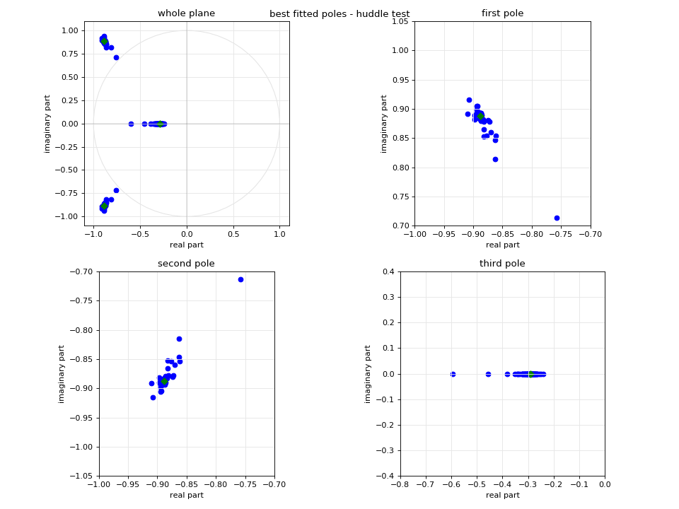

# seismo-huddle
These files are used to perform a huddle test with seismometers. It's a relative calibration of the poles, zeroes and the Gain of the sensors.


### Requirements
* [ObsPy](http://obspy.org)
* [dinver](http://www.geopsy.org/download.php) - from the Geopsy package


### Background
Input are continuous seismic data of two or more seismometers in very close distance (cm) to each other measuring hours of the same noise. Best results are achieved with a big earthquake during sensing period. Only compare data of the same component! The example data provided in the repository is from a huddle test in Potsdam, Germany. Only vertical components are used around the time of a [M6.7 earthquake in Brazil](https://geofon.gfz-potsdam.de/eqinfo/event.php?id=gfz2019aiuk). In case you want to use a different dataset and/or a different event, please change in the file "huddle-test-T2.py" if necessary:

* datadir
* start(time) & end(time)
* all Poles and Zeros (PAZ) and sampling frequency


### workflow

1.)
```
$ python huddle-test-T2.py
```
Calculates all relative transferfunctions of all seismometer combination of the huddle test. The estimated transfer function (based on Havskov Instrumentation in Earthquake Seismology', p. 293-294) will be stored in a .txt-file in a separate subfolder (here /transfer-functions). Adjust input and output names in file.

2.)
```
$ bash huddle-dinver-run.sh
```
(uses script "huddle-test-optimizer.py)

A forward modeling of all given transferfunctions will be done with dinver. First, the python script "huddle-test-optimizer.py" will be adjusted automatically. Second, dinver will use this python script to optimize the Poles and Zeros and Gain. All free parameters, which will be optimized are provided in the .dinver-file and can be changed in there (with the use of dinver). The communication between the python script to be optimized and the forward modelling of dinver is done via the files "parameters" and "misfit". They are automatically created/removed and should not be changed during the calculations. The results (poles, zeroes, Gain, misfit) of each calculation step are stored in log files in the subfolder /misfits-log. An overview of the forward models can be found in run-reports.

3.)
```
$ python sort-misfits.py
```
The log files of the forward modelling are sorted in ascending order by their misfits.

4.)
```
$ bash huddle-results.sh
```
The uppermost lines (the results of smallest misfit) of all given ordered log-files are stored separately in the file "huddle-results.txt"

5.)
```
$ python huddle-analysis.py
```
A small python script to plot all poles (imaginary over real part) derived from forward modelling, with smallest misfit (see results section).

### Results

The resulting plot, as shown above, will give show all poles in different subplots. Since this example was performed with Lennartz instruments only the three poles are shown (zeros are three complex zeros). In the upper left panel, the whole complex plane is shown with all poles. The other three panels show each pole in close up for visual control.

In the *huddle-analysis.py* file the theoretical poles and zeros can be adjusted at the top of the file (in case you don't know the instrument specifications...). Those theoretical values will be shown as green diamonds in the plot. In addition, one station/sensor can be chosen to be highlighted (variable *highl*) in a different color.

This workflow inverted for poles, zeros and the gain, but the latter is not visually controlled yet. Feel free to suggest something for that. The values can be found in the *huddle-result.txt* file in the second last column.

### Citation

Havskov, J., & Alguacil, G. (2004). Instrumentation in earthquake seismology.
